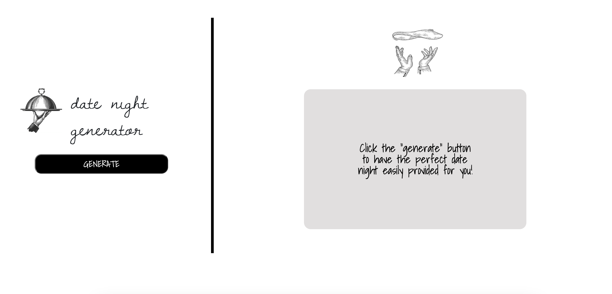

# date-night

https://cassidykovell.github.io/date-night/

## Description

This webpage provides a date night for its user by randomly generating both drinks and a meal for a date. 

## Installation
No notes for installation.

## Usage
In order to use this website the user must click the 'generate' button. Once the user has clicked the 'generate' button two items will appear, one with a name and photo of a drink, and one with a name and photo of a meal. If for some reason the user does not like either one or both of the options provided two buttons have been displayed to the left one to generate a new drink recipe and one to generate a new meal recipe. Once the user is satisfied with the items provided they can click the 'see recipes' button and the name, photo, and recipe of both the cocktail and the meal will be displayed for the user.

## Credits
Collaberation of Chris Lowenthal, Giovanna Domingues, and Cassidy Kovell

## License

## Badges

## Features
The features for this webpage inculding calling randomly from two APIs one for cocktails and one for meals and then when they are both generated they are stored in local storage so they can be displayed for the user. 

## How to Contribute

## Tests